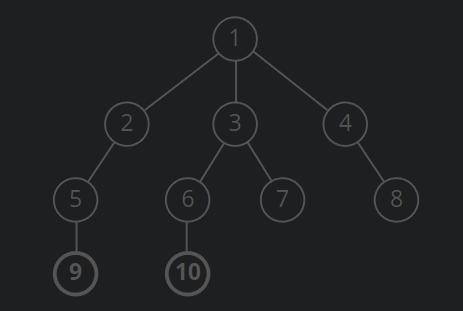

# ShortestPathBFS
A Java 'shortest path' breadth first search implementation on an undirected acyclic graph.

The class uses an adjacency list as the data structure to hold the vertices and edges.

The assumption made is that vertices will be numbered starting from 1 (i.e. there will be no 0 node).

I have opted to not read in user input for this implementation, as I've realized it can be quite a lengthy
process to manually capture vertices and edges through the command line, and the process is also prone to mistakes. 
The program should therefore be used/tested by altering the example given in the main method.

For reference, this is the graph used in the example in the main method:

